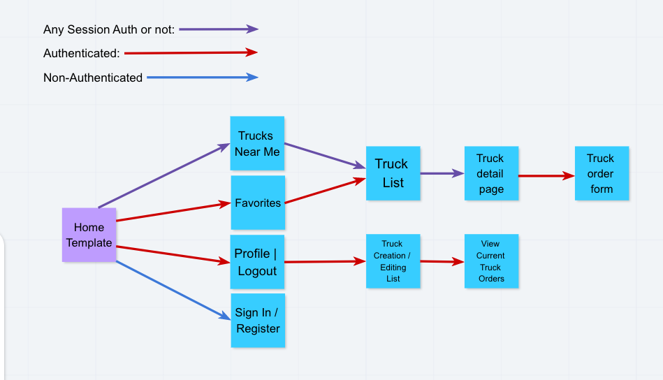
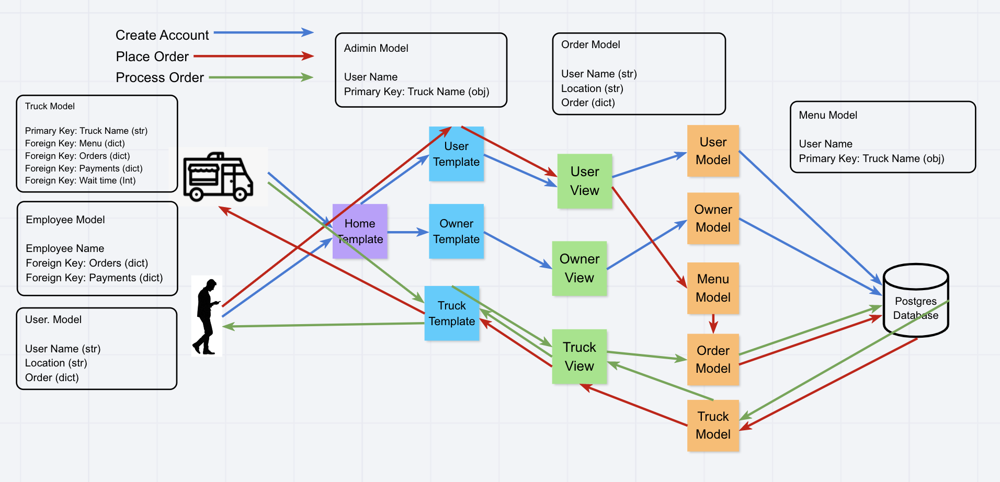
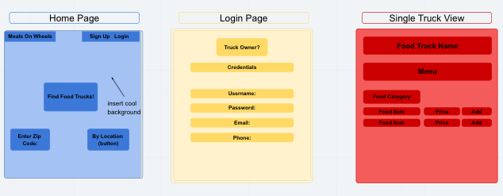

# Food Truck App
#### Deployed URL:
https://food-truck-locator-fellows.herokuapp.com/

## Authors
Alex Peña, Robert Radford, Seth McFeaters, Brendan W

## Overview
 this app ends to connect food truck owners with potential customers. It allows food truck owners to create a profile and list their menu items which a user can view if in the local area and place an order without having to actually be at the food truck.

## Wireframe & Domain Model




### Version 1.0.0
Basic scaffolding and dependencies.

### User Stories
- As a business I would like to create an account.
- As a business, I would like to show my contact information.
- As a business I would like to add menu items.
- As a business I would like to edit my location,  menu items, prices, current wait time, and hours. .

- As a customer I would like to create an account.
- As a customer I would like to see a list of nearby food trucks.
- As a customer I would like to look through a specific vendors menu items.
- As a customer I would like to add items to a cart and place order.


### Dependencies
python = "^3.8"
Django = "^3.1.5"
djangorestframework = "^3.12.2"
psycopg2-binary = "^2.8.6"
djangorestframework-simplejwt = "^4.6.0"
django-environ = "^0.4.5"
whitenoise = "^5.2.0"
gunicorn = "^20.0.4"
locationiq = "^0.0.2"
geocoder = "^1.38.1"
multidict = "^5.1.0"
Pillow = "^8.1.0"
googlemaps = "^4.4.2"

### Local Install Instructions 
*for development use purposes*

1. Clone repository locally
2. Add the following enviromental variables in a ```.env``` file in dir ```/setup```
   - SECRET_KEY=(exists in settings.py)
   - DATABASE_URL=
   - DATABASE_NAME=
   - DATABASE_USER=
   - DATABASE_HOST=otto.db.elephantsql.com
   - DATABASE_PASSWORD=
   - DATABASE_PORT=5432
   - ALLOWED_HOSTS=localhost,127.0.0.1
   - GOOGLE_API_KEY=
3. Install **Python** & **Poetry** on loacal machine
4. Create free database account @ https://www.elephantsql.com
5. To install django project and all dependencies run...
   ```$ poetry install```
   then...
6. ```$ python manage.py createsuperuser```
   *follow all prompts*
7. ```$ python manage.py make migrations```
8. ```$ python manage.py migrate```
   to initialize database
9.  ```$ python manage.py runserver```
    Launch URL and **Enjoy!!!**
